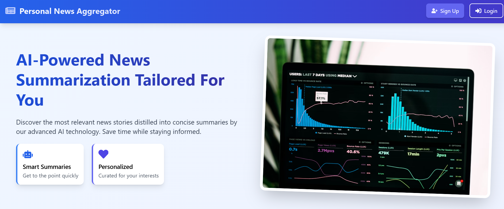
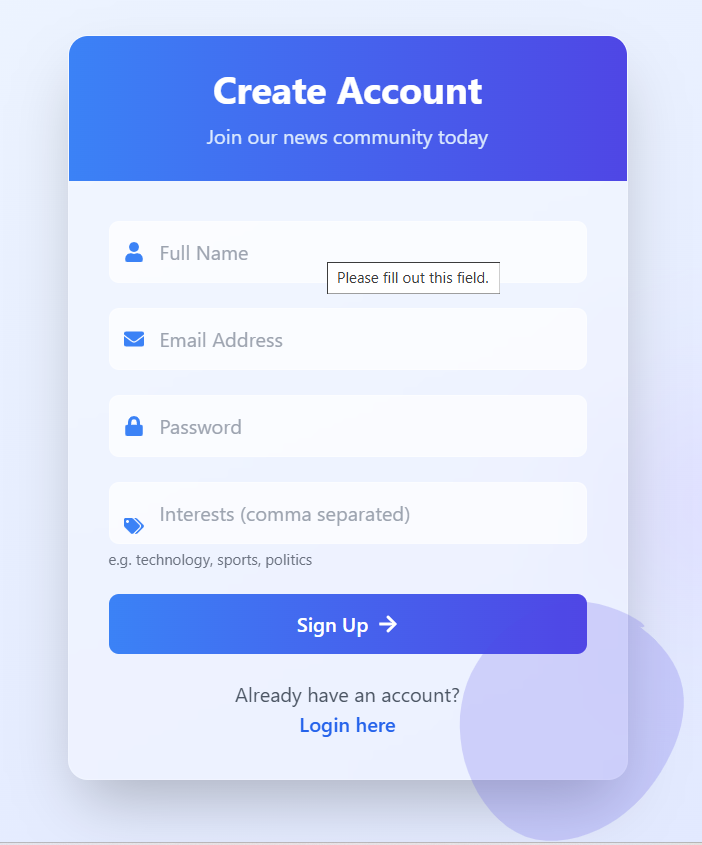
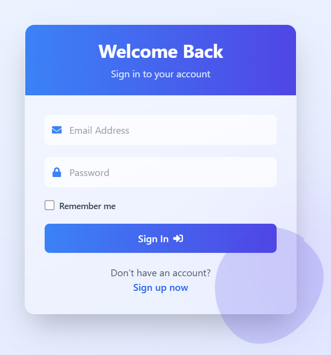
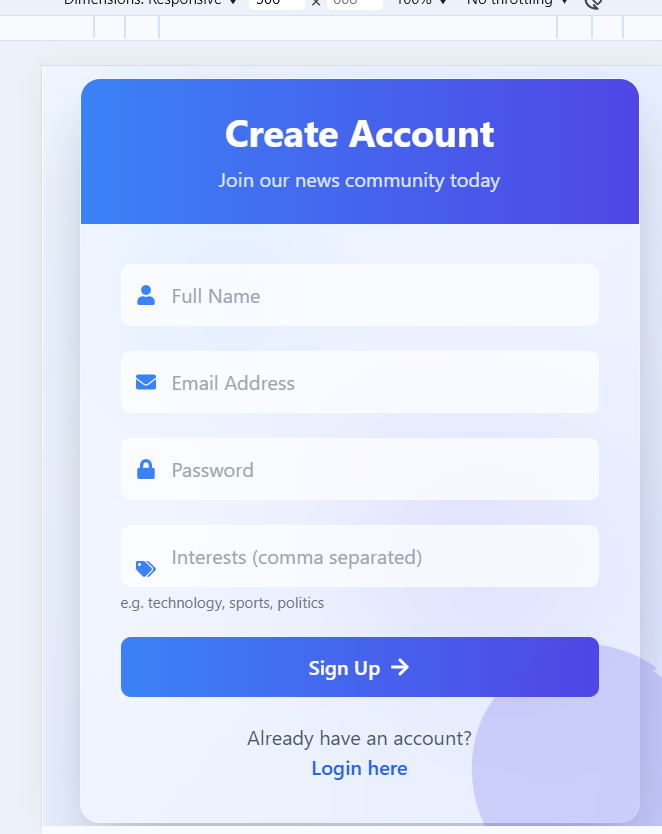
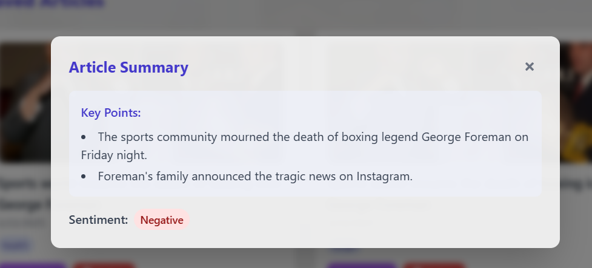

# Personal News Aggregator with AI Summarization

## 🚀 Overview
This project is a **Personal News Aggregator** that fetches news articles from various sources based on user preferences and provides AI-powered summaries. Users can customize their news feed, save articles for later reading, and quickly grasp key points with AI-generated summaries.

## 🎯 Features
### 🔐 User Authentication
- Signup/Login functionality
- User profile with interests selection
- JWT-based authentication

### 📰 News Feed
- Fetches news from public APIs like **NewsAPI, Guardian API**
- Filters articles based on user-selected topics
- Displays article images, titles, and publication dates

### 📑 Article Management
- Save articles for later reading
- Mark articles as read
- Organize articles using tags or categories

### 🤖 AI-Powered Features
- **One-click article summarization** (3-5 key points per article)
- **Basic sentiment classification** (Positive/Negative/Neutral)
- **Personalized recommendations** based on reading history

### 📱 Responsive Design
- Clean and modern UI
- Mobile-friendly layout using **Tailwind CSS**

---

## 🛠️ Tech Stack
### 🏗 Backend (Node.js + Express)
- **Node.js** with **Express.js** for server-side logic
- **MongoDB** for storing user profiles and saved articles
- **JWT authentication** for secure access control

### 🎨 Frontend (React.js)
- **React.js** with hooks for UI development
- **Redux/TanStack** for state management
- **Tailwind CSS** for styling

### 🧠 AI Component
- **Summarization API** for concise news summaries
- **Sentiment Analysis API** for categorizing articles
- **Content Recommendation System** based on user activity

---

## 📸 Screenshots
| Homepage | Signup | Signin | Main Page | Profile Page | Saved Articles |
|----------|----------|------------|------------|------------|------------|
|  |  |  |  |  |  |

| Mobile View | AI Summary |
|------------|------------|
|  |  |

---

## 🚀 Getting Started
### 🔹 Prerequisites
Ensure you have the following installed:
- **Node.js** (v16+)
- **MongoDB** (local or cloud instance)
- **NPM/Yarn**

### 🔹 Installation Steps
1. **Clone the repository**
   ```sh
   git clone https://github.com/20A21A04D2/news-aggregator.git
   cd news-aggregator
   ```
2. **Backend Setup**
   ```sh
   cd backend
   npm install
   node app.js
   ```
3. **Frontend Setup**
   ```sh
   cd frontend
   npm install
   npm start
   ```
4. **Environment Variables (.env)**
   Create a `.env` file in both frontend and backend directories with the required API keys.

---

## 🚀 Live Demo
Check out the deployed version: [Live Demo](<your-live-demo-link>)

---

## 🤝 Contribution
Contributions are welcome! Fork this repo and submit a pull request.

---

## 📜 License
This project is licensed under the MIT License.
